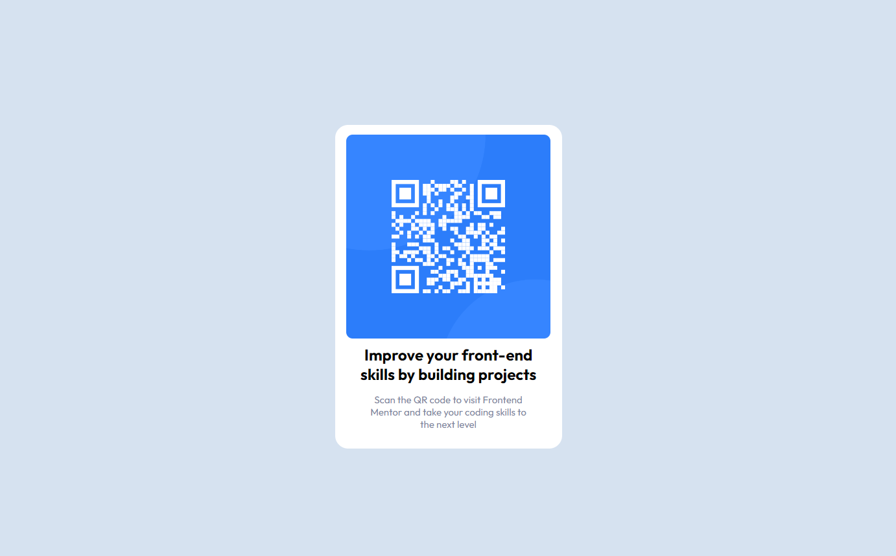

# Frontend Mentor - QR code component solution

This is a solution to the [QR code component challenge on Frontend Mentor](https://www.frontendmentor.io/challenges/qr-code-component-iux_sIO_H). Frontend Mentor challenges help you improve your coding skills by building realistic projects. 

## Table of contents

- [Overview](#overview)
  - [Screenshot](#screenshot)
  - [Links](#links)
- [My process](#my-process)
  - [Built with](#built-with)
  - [What I learned](#what-i-learned)
  - [Continued development](#continued-development)
  - [Useful resources](#useful-resources)
- [Author](#author)
- [Acknowledgments](#acknowledgments)

**Note: Delete this note and update the table of contents based on what sections you keep.**

## Overview

### Screenshot



### Links

- Live Site URL: [QR Code](https://pipendog.github.io/QR-Code/)

## My process

### Built with

- Semantic HTML5 markup
- CSS custom properties
- Flexbox

### What I learned
Starting to understand how flex layout works. Need more practice but im proud im learning codes that help center divs

```html
 <meta charset="UTF-8">
 <meta name="viewport" content="width=device-width, initial-scale=1.0">
```
```css
section {
  display: flex;
  justify-content: center;
  box-sizing: border-box;
}
```

### Continued development

Need more practice understanding page layout properties.
planning to get started on grid soon to see how i can use it to better my page layout skills.

### Useful resources

- [Layout with Flexbox](https://www.codecademy.com/learn/learn-intermediate-css/modules/layout-with-flexbox/cheatsheet) - This helped me for understanding flexbox properties.
- [HTML elements references](https://developer.mozilla.org/en-US/docs/Web/HTML/Element) - This is an amazing page which helped me remember what elements to use. I'd recommend it to anyone still learning HTML.


## Author

- Website - [Stevenson Jean](https://github.com/Pipendog)
- Frontend Mentor - [@pipendog](https://www.frontendmentor.io/profile/pipendog)
- Twitter - [@pipenluv](https://www.twitter.com/pipenluv)


## Acknowledgments

[@Danielfww](https://www.frontendmentor.io/profile/Danielfww)
